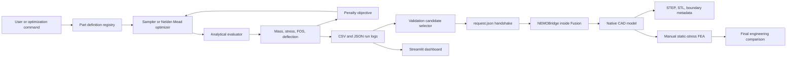
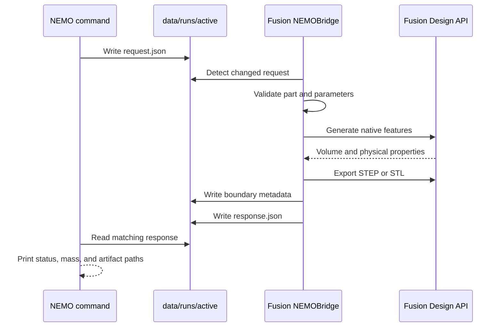
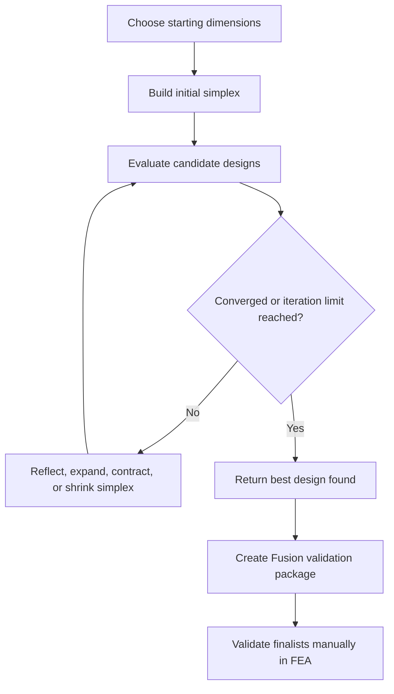

# NEMO - Nelder-Mead Marine Optimizer

NEMO is a code-generated CAD and structural design optimization project for
marine components. It combines Python, analytical engineering models, Autodesk
Fusion, and the Nelder-Mead optimization algorithm to search for lighter designs
that still satisfy strength and deflection limits.

This README is written as a complete reader and setup guide. It assumes that the
reader has never programmed, used a command line, installed a Python project, or
worked with a CAD automation add-in.

> [!IMPORTANT]
> NEMO is an academic engineering tool. Its analytical calculations are intended
> for design screening, not certification. Any part intended for manufacture,
> lifting, or installation on a vessel must be checked using appropriate design
> codes, validated FEA, material certificates, load cases, fatigue assessment,
> corrosion allowances, weld design, and review by a qualified engineer.

## Contents

1. [What NEMO Does](#what-nemo-does)
2. [The Three Case Studies](#the-three-case-studies)
3. [How the System Works](#how-the-system-works)
4. [Important Terms](#important-terms)
5. [Brand-New Laptop Setup](#brand-new-laptop-setup)
6. [One-Command Build Script](#one-command-build-script)
7. [First Offline Run](#first-offline-run)
8. [Autodesk Fusion Setup](#autodesk-fusion-setup)
9. [Generate CAD from Python](#generate-cad-from-python)
10. [Sampling and Optimization](#sampling-and-optimization)
11. [Manual FEA Validation](#manual-fea-validation)
12. [Results Dashboard](#results-dashboard)
13. [Files Produced by NEMO](#files-produced-by-nemo)
14. [Command Reference](#command-reference)
15. [Testing](#testing)
16. [Troubleshooting](#troubleshooting)
17. [Repository Structure](#repository-structure)
18. [Limitations and Future Work](#limitations-and-future-work)

## What NEMO Does

Traditional design optimization often looks like this: create one CAD model,
run a structural analysis, inspect the result, change a dimension, and repeat.
NEMO automates the repetitive mathematical part of that process.

NEMO can:

- describe each component using named design variables;
- generate candidate dimensions inside defined engineering bounds;
- estimate mass, stress, factor of safety, and deflection analytically;
- reject invalid or unsafe candidates with an optimization penalty;
- use Nelder-Mead to search for a lower-mass feasible design;
- record every evaluated design in CSV and JSON files;
- ask a Fusion add-in to construct native CAD from code;
- export STEP, STL, and semantic boundary metadata;
- package the best candidates for manual Fusion FEA validation; and
- display convergence and engineering results in a Streamlit dashboard.

The Python-only features work without Fusion. Fusion is required only for native
CAD generation, STEP/STL export, and manual FEA validation.

## The Three Case Studies

| Part ID | Component | Material | Design load | Required FOS | Deflection limit |
| :-- | :-- | :-- | --: | --: | --: |
| `bracket` | Marine equipment mounting bracket | Aluminum 6061-T6 | 1,471.5 N | 2.5 | 0.5 mm |
| `padeye` | Gusseted marine lifting padeye | S275 structural steel | 14,715 N | 2.5 | 0.5 mm |
| `stabilizer` | Hollow small-craft stabilizer fin | Aluminum 6061-T6 | 11,808 N | 2.5 | 5.0 mm |

### Bracket

The bracket is the original proof-of-concept. It has a baseplate, bolt holes,
two reinforcing ribs, and a root fillet. Its six variables are baseplate length,
baseplate width, baseplate thickness, rib height, rib thickness, and fillet
radius.

### Padeye

The padeye is a more realistic prismatic marine structure. It contains a doubler
plate, tapered central lug, 50 mm pin hole, twin gussets, and root fillets. Its
nine variables control the plate, lug, neck, gussets, and fillet.

The analytical model checks several first-order failure mechanisms:

- net-section tension beside the pin hole;
- pin bearing stress;
- shear-out near the hole;
- lug-root bending;
- gusset stiffness; and
- pin-point displacement.

### Stabilizer

The stabilizer demonstrates more complex lofted CAD. It uses a fixed NACA 0015
outer envelope with an 800 mm span, tapered chord, sweep, hollow skin, two spars,
three ribs, root reinforcement, and a mounting flange.

Only the internal structure is optimized. The outer hydrodynamic shape stays
fixed because NEMO does not yet calculate lift, drag, cavitation, or vessel
control performance.

The complete parameter definitions, units, bounds, materials, loads, fixed
geometry, and boundary names are stored in:

```text
src/nemo/parts/definitions/
```

## How the System Works

### Overall architecture



### One analytical evaluation

1. A part is selected using its ID, such as `padeye`.
2. NEMO loads that part's parameter bounds, material, load, and constraints.
3. The requested dimensions are checked for missing, unknown, or out-of-range
   values.
4. The corresponding analytical model estimates volume and mass.
5. The model estimates stress and deflection.
6. Factor of safety is calculated from material yield strength divided by the
   estimated maximum stress.
7. NEMO calculates an objective value.
8. The result is returned and, during a run, appended to `results.csv`.

The objective is approximately:

```text
objective = mass
          + penalty_weight * normalized_FOS_shortfall^2
          + penalty_weight * normalized_deflection_excess^2
```

A light but unsafe design therefore receives a high score. The optimizer seeks
the lowest score, so it is encouraged toward light designs that also satisfy the
constraints.

### One Fusion CAD request



The exchange uses files instead of a network server. The Python program and
Fusion communicate through:

```text
data/runs/active/request.json
data/runs/active/response.json
```

### The optimization loop



Nelder-Mead is gradient-free. It does not need a derivative of the CAD or FEA
model. It moves and reshapes a set of candidate points called a simplex. This is
useful when evaluations are expensive or slightly noisy.

## Important Terms

| Term | Plain-language meaning |
| :-- | :-- |
| CAD | Computer-Aided Design: the 3D model of the part. |
| FEA | Finite Element Analysis: a numerical structural simulation. |
| Parameter | A named number that controls geometry, such as plate thickness. |
| Baseline | The starting or reference design. |
| Candidate | One particular combination of parameter values. |
| Objective | The number the optimizer tries to minimize. |
| Constraint | A rule the design must satisfy, such as minimum FOS. |
| FOS | Factor of safety: yield strength divided by calculated stress. |
| Deflection | How far the loaded component moves or bends. |
| Iteration | One step of the optimization process. |
| Latin hypercube | A method for spreading samples across the design space. |
| Nelder-Mead | The gradient-free optimization algorithm used by NEMO. |
| JSON | A structured text format used for requests, responses, and metadata. |
| CSV | A table-like text format opened by Excel or data-analysis software. |
| STEP | A standard CAD exchange file containing solid geometry. |
| STL | A triangulated surface format often used for visualization or printing. |
| Add-in | Code loaded inside Fusion to extend what Fusion can do. |
| Virtual environment | A private Python installation used only by this project. |

## Brand-New Laptop Setup

The instructions below are Windows-first because the existing project and
Fusion bridge were developed and tested on Windows.

Whenever this guide shows a box labelled `powershell`, type or paste only the
text inside the box into PowerShell, then press Enter. Do not type the word
`powershell` itself. Run one command box at a time and wait for the prompt to
return before continuing.

### 1. Check the laptop

Recommended practical hardware for repeated CAD and FEA work:

- Windows 11, fully updated;
- a modern 64-bit Intel or AMD processor;
- at least 16 GB RAM, preferably 32 GB;
- at least 20 GB free storage for software, CAD files, meshes, and results;
- a supported graphics adapter with current drivers; and
- a stable internet connection for installing Fusion and Python packages.

Check Autodesk's current [Fusion system requirements](https://help.autodesk.com/view/fusion360/ENU/?caas=caas%2Fsfdcarticles%2Fsfdcarticles%2FSystem-requirements-for-Autodesk-Fusion-360.html)
before purchasing or configuring hardware.

### 2. Install Python

Python runs the optimizer, analytical models, tests, and dashboard.

1. Open the official [Python for Windows download page](https://www.python.org/downloads/windows/).
2. Install a 64-bit Python release. Python 3.12 or 3.13 is a conservative choice
   for scientific-package compatibility; NEMO requires Python 3.10 or newer.
3. On the first installer screen, enable **Add python.exe to PATH**.
4. Choose **Install Now**.
5. When installation finishes, close the installer.

Verify the installation:

1. Press the Windows key.
2. Type `PowerShell`.
3. Open **Windows PowerShell** or **Terminal**.
4. Enter:

```powershell
python --version
```

You should see a version such as `Python 3.12.x`. If `python` is not recognized,
try:

```powershell
py --version
```

### 3. Install Git

Git downloads the project and tracks source-code changes.

1. Download [Git for Windows](https://git-scm.com/install/windows).
2. Run the installer.
3. For a beginner installation, accept the default options.
4. Close and reopen PowerShell after installation.

Verify it:

```powershell
git --version
```

If the project was provided as a ZIP folder, Git is optional. Extract the ZIP to
a permanent location such as `Documents\Projects\NEMO` and continue at step 5.

### 4. Install Autodesk Fusion

Fusion generates the native CAD and performs manual FEA validation.

1. Create or sign in to an Autodesk account.
2. Install Autodesk Fusion from the official Autodesk product or education
   portal.
3. Confirm that the selected entitlement provides the Simulation workspace
   needed for Static Stress studies.
4. Start Fusion once and complete its first-run sign-in and update process.
5. Close Fusion before continuing with the project setup.

The analytical NEMO workflow still works if Fusion or Simulation is unavailable.
Only CAD generation and manual FEA validation will be unavailable.

### 5. Obtain the project

Choose one of the following methods.

#### Method A: clone with Git

In PowerShell, move to a location where the project should be stored:

```powershell
Set-Location "$HOME\Documents"
New-Item -ItemType Directory -Path "Projects" -Force
Set-Location "Projects"
```

Clone the repository. Replace `<REPOSITORY_URL>` with the URL supplied by the
project owner:

```powershell
git clone <REPOSITORY_URL> NEMO
Set-Location "NEMO"
```

#### Method B: use an extracted folder

Open the folder in File Explorer. Click the address bar, type `powershell`, and
press Enter. PowerShell will open directly in that folder.

Confirm that you are in the correct location:

```powershell
Get-ChildItem
```

You should see `README.md`, `pyproject.toml`, `src`, `tests`, `dashboard`, and
`fusion_addin`.

> [!IMPORTANT]
> Keep the project in a permanent folder. Do not move it after linking the Fusion
> add-in. Fusion remembers the linked folder location.

### 6. Create the Python virtual environment

A virtual environment keeps this project's packages separate from other Python
programs.

From the NEMO project folder, run:

```powershell
python -m venv .venv
```

If `python` is unavailable but `py` works, run:

```powershell
py -3 -m venv .venv
```

The new `.venv` folder is local and should not be shared or committed to Git.

### 7. Install NEMO and its dependencies

Using the virtual environment's Python directly avoids PowerShell activation
problems:

```powershell
.\.venv\Scripts\python.exe -m pip install --upgrade pip
.\.venv\Scripts\python.exe -m pip install -e ".[dev]"
```

This installs NumPy, SciPy, pandas, Plotly, Streamlit, pytest, and the `nemo`
command.

The `-e` means editable installation. Changes made to the source code are used
without reinstalling the whole project.

### 8. Run the offline tests

```powershell
.\.venv\Scripts\python.exe -m pytest -q
```

The normal suite should pass. Two Fusion integration tests are intentionally
skipped unless they are explicitly enabled while Fusion is running.

### 9. Confirm that the command-line program works

```powershell
.\.venv\Scripts\nemo.exe parts
```

The output should list `bracket`, `padeye`, and `stabilizer` with their parameter
ranges.

### Optional: activate the environment

Activation shortens later commands from `.\.venv\Scripts\nemo.exe` to `nemo`.

```powershell
Set-ExecutionPolicy -Scope Process -ExecutionPolicy Bypass
.\.venv\Scripts\Activate.ps1
```

`-Scope Process` changes the policy only for the current terminal window. When
the terminal closes, the temporary setting disappears.

After activation, the prompt normally begins with `(.venv)`.

## One-Command Build Script

The repository includes `build.bat`, a Windows launcher for users who do not
want to type every Python command manually.

Double-click `build.bat` in File Explorer to open a menu. The recommended menu
option runs the complete analytical workflow for the padeye and stabilizer.

From PowerShell, the same launcher supports explicit commands:

```powershell
.\build.bat setup
.\build.bat check
.\build.bat pipeline advanced
.\build.bat pipeline all
.\build.bat fusion advanced
.\build.bat dashboard
```

### What `pipeline` automates

For every selected part, the script:

1. creates or repairs the virtual environment when necessary;
2. runs the offline test suite;
3. evaluates the configured baseline;
4. generates 60 Latin-hypercube samples;
5. runs Nelder-Mead from the baseline;
6. selects two feasible alternative starting points;
7. runs Nelder-Mead from each available alternative;
8. combines all run logs;
9. selects the baseline and five low-mass feasible candidates; and
10. creates the final Fusion validation package and checklist.

Outputs use a timestamp so an earlier run is not overwritten:

```text
data\runs\<timestamp>_<part>_sample\
data\runs\<timestamp>_<part>_optimize_baseline\
data\runs\<timestamp>_<part>_optimize_start_01\
data\runs\<timestamp>_<part>_optimize_start_02\
reports\<timestamp>_<part>_validation\
```

### What `fusion` adds

`build.bat fusion advanced` first completes the analytical pipeline. It then
sends every selected validation candidate to NEMOBridge and requests STEP plus
boundary metadata.

Fusion must already be open and NEMOBridge must already be running. The command
stores each Fusion response under the validation package's `fusion_responses`
folder.

### What cannot be automated yet

The batch file cannot complete Fusion Static Stress solving or read FEA results.
Those actions remain manual. Therefore, "entire pipeline" currently means:

```text
setup -> tests -> sampling -> multi-start optimization -> candidate selection
      -> optional Fusion CAD export -> manual FEA validation
```

The script finishes by printing the path to each `VALIDATION_CHECKLIST.md`.
Complete those checklists in Fusion before making engineering claims.

### Faster smoke run

The defaults are 60 samples and 80 iterations per optimizer start. For a quick
software check, temporarily reduce them in the current PowerShell window:

```powershell
$env:NEMO_SAMPLE_COUNT = "5"
$env:NEMO_MAX_ITER = "5"
.\build.bat pipeline padeye
Remove-Item Env:NEMO_SAMPLE_COUNT
Remove-Item Env:NEMO_MAX_ITER
```

Do not use a smoke-run result as the final engineering optimum.

## First Offline Run

Fusion is not needed for this section.

### 1. List the available parts

```powershell
.\.venv\Scripts\nemo.exe parts
```

### 2. Evaluate all three baseline designs

```powershell
.\.venv\Scripts\nemo.exe evaluate --part bracket
.\.venv\Scripts\nemo.exe evaluate --part padeye
.\.venv\Scripts\nemo.exe evaluate --part stabilizer
```

Each command prints JSON containing:

- `status`: whether the evaluation succeeded;
- `mass_kg`: estimated mass;
- `max_stress_mpa`: estimated maximum stress;
- `factor_of_safety`: estimated FOS;
- `max_deflection_mm`: estimated maximum movement;
- `objective_value`: mass plus any constraint penalties; and
- `volume_m3`: estimated material volume.

An analytical success looks like:

```json
{
  "schema_version": 2,
  "part_id": "padeye",
  "status": "ok",
  "metrics": {
    "mass_kg": 10.49,
    "max_stress_mpa": 46.11,
    "factor_of_safety": 5.96,
    "max_deflection_mm": 0.013,
    "objective_value": 10.49
  }
}
```

Values may change as models are calibrated. `status: "ok"` is the important
first check.

## Autodesk Fusion Setup

NEMOBridge is a Fusion add-in. It runs inside Fusion and watches the handshake
folder for new requests.

### Recommended method: link the add-in from the repository

This method keeps one copy of the code and preserves the relative configuration
paths.

1. Start Autodesk Fusion.
2. Open the **Utilities** tab.
3. Select **Scripts and Add-Ins**.
4. Open the **Add-Ins** tab.
5. Click the green **+** button or **Script or add-in from device**.
6. Browse to the NEMO project folder.
7. Select this folder:

```text
fusion_addin\NEMOBridge
```

8. Confirm the selection. `NEMOBridge` should appear in the Add-Ins list.
9. Select `NEMOBridge` and click **Run**.
10. Fusion should show a message stating that NEMOBridge is watching for
    `request.json`.

Autodesk documents this linked-folder workflow in its
[Scripts and Add-Ins guide](https://help.autodesk.com/cloudhelp/ENU/Fusion-360-API/files/WritingDebugging_UM.htm).

### Configuration

The portable default configuration is:

```json
{
  "handshake_dir": "../../data/runs/active",
  "artifact_dir": "../../data/runs/active/artifacts",
  "part_definition_dir": "../../src/nemo/parts/definitions",
  "poll_seconds": 1.0
}
```

This file is located at:

```text
fusion_addin\NEMOBridge\config.json
```

The relative paths work when the add-in is linked from its repository folder.
Do not copy only the add-in folder elsewhere unless these three paths are changed
to absolute paths that point back to the project.

### Confirm that the bridge is running

After clicking **Run**, check:

```text
data\runs\active\NEMOBridge.log
```

Open the file in Notepad. A recent line should contain:

```text
NEMO Bridge v2 started.
```

Keep Fusion open and keep the add-in running while using `nemo cad` or the Fusion
integration tests.

### Active design type

Current Fusion releases distinguish Part, Assembly, and Hybrid designs. Before
running `nemo cad`, create or activate a blank **Hybrid Design** using
**File > New... > Hybrid Design**. NEMO creates an internal generated component;
a Part Design rejects additional components. Generator edits are reloaded before
each serialized request. Stop and restart NEMOBridge after changing
`NEMOBridge.py` itself or its configuration.

## Generate CAD from Python

### Generate the bracket baseline

```powershell
.\.venv\Scripts\nemo.exe cad --part bracket --artifact step --artifact boundary_tags
```

The bracket must contain one connected solid, four mounting holes, two
full-length triangular ribs above the baseplate, four tagged cylindrical support
faces, and tagged upper rib load faces. NEMOBridge rejects the result instead of
reporting `partial` if these requirements are not met.

### Generate the padeye baseline

With Fusion and NEMOBridge running, open PowerShell in the NEMO folder and run:

```powershell
.\.venv\Scripts\nemo.exe cad --part padeye --artifact step --artifact boundary_tags
```

NEMO will wait for Fusion. Fusion should create a generated component, calculate
its volume, export STEP, and return a response.

The padeye generator requires one connected solid. The doubler plate, lug, and
four external gusset wings overlap volumetrically and are joined explicitly.
The pin bore is cut last, and the two lug-root fillets are created before the
gussets. `fixed_support` identifies only the bottom mounting face;
`pin_bearing` identifies the cylindrical pin-bore face.

The expected response has `status: "partial"`. Partial is correct: CAD and mass
were completed, but automated FEA results are unavailable.

### Generate the stabilizer baseline

```powershell
.\.venv\Scripts\nemo.exe cad --part stabilizer --artifact step --artifact boundary_tags
```

Inspect the Fusion model for:

- a swept and tapered NACA 0015 envelope;
- a hollow cavity;
- front and rear spars;
- three internal ribs;
- root reinforcement; and
- the root mounting flange.

The generator applies the fin-to-flange root fillet before hollowing the
envelope. `fixed_support` and `tip_monitor` each identify one face, while the
four pressure bands identify only the external positive-Y skin.

### Export STL as well

```powershell
.\.venv\Scripts\nemo.exe cad --part stabilizer --artifact step --artifact stl --artifact boundary_tags
```

Artifacts are written beneath:

```text
data\runs\active\artifacts\<run_id>\
```

### Generate custom dimensions

Create a JSON file such as `padeye_custom.json` in the project folder:

```json
{
  "parameters": {
    "base_length": 270,
    "base_width": 185,
    "base_thickness": 12,
    "lug_height": 190,
    "lug_thickness": 18,
    "neck_width": 105,
    "gusset_height": 115,
    "gusset_thickness": 9,
    "fillet_radius": 16
  }
}
```

Generate it with:

```powershell
.\.venv\Scripts\nemo.exe cad --part padeye --params-json padeye_custom.json --artifact step --artifact boundary_tags
```

Every required parameter must be present and inside its configured range.

## Sampling and Optimization

### Why sample before optimizing?

A design-space sample checks whether the model behaves sensibly before an
optimizer begins making decisions. It helps reveal invalid geometry, unexpected
stress trends, and bounds that are too wide or too narrow.

### Run a padeye sample

Using an explicit run folder makes later commands easier:

```powershell
.\.venv\Scripts\nemo.exe sample --part padeye --count 60 --method latin --seed 42 --run-dir data\runs\padeye_sample
```

This produces:

```text
data\runs\padeye_sample\run.json
data\runs\padeye_sample\results.csv
```

### Run a stabilizer sample

```powershell
.\.venv\Scripts\nemo.exe sample --part stabilizer --count 60 --method latin --seed 42 --run-dir data\runs\stabilizer_sample
```

### Run optimization from the baseline

```powershell
.\.venv\Scripts\nemo.exe optimize --part padeye --max-iter 80 --run-dir data\runs\padeye_optimize_baseline
```

```powershell
.\.venv\Scripts\nemo.exe optimize --part stabilizer --max-iter 80 --run-dir data\runs\stabilizer_optimize_baseline
```

Each optimization folder contains:

- `run.json`: part, material, load, constraints, and parameter metadata;
- `results.csv`: every unique evaluation; and
- `optimization_summary.json`: best parameters and objective found.

### Create a first validation package

Padeye:

```powershell
.\.venv\Scripts\nemo.exe validation-package --part padeye data\runs\padeye_sample\results.csv data\runs\padeye_optimize_baseline\results.csv --count 5 --output-dir reports\padeye_validation
```

Stabilizer:

```powershell
.\.venv\Scripts\nemo.exe validation-package --part stabilizer data\runs\stabilizer_sample\results.csv data\runs\stabilizer_optimize_baseline\results.csv --count 5 --output-dir reports\stabilizer_validation
```

Each package contains the baseline plus five low-mass feasible candidates, a CSV
summary, Fusion request files, and a manual validation checklist.

### Run from another starting point

Nelder-Mead can converge to different local solutions from different starting
points. Use a selected candidate request as a second start:

```powershell
.\.venv\Scripts\nemo.exe optimize --part padeye --start-json reports\padeye_validation\fusion_requests\candidate_01_request.json --max-iter 80 --run-dir data\runs\padeye_optimize_candidate_01
```

After running additional starts, regenerate the validation package and include
all relevant CSV files in the command.

## Manual FEA Validation

Fusion Simulation is intentionally manual in this version. The installed Fusion
API did not expose a reliable supported route for starting Static Stress solves
and extracting maximum stress, FOS, and deflection.

### General validation sequence

1. Generate the candidate using its request JSON.
2. Confirm that the CAD timeline is healthy and the component is connected.
3. Confirm the assigned material.
4. Create or update a Static Stress study.
5. Reapply or verify all loads and constraints.
6. Check contacts between connected bodies; use bonded contact where appropriate.
7. Generate a mesh and refine stress-concentration regions.
8. Solve the study.
9. Record mass, maximum von Mises stress, minimum FOS, and maximum deflection.
10. Enter results in the package's `VALIDATION_CHECKLIST.md` or an equivalent
    results table.
11. Compare the FEA result with the analytical estimate.

The generator rebuilds its component for each request so every parameter changes
the actual solid. Rebuilding can invalidate Simulation face references. Always
verify or reapply loads and constraints for every candidate.

### Padeye FEA procedure

1. Generate the padeye candidate in Fusion.
2. Switch from **Design** to **Simulation**.
3. Create a **Static Stress** study.
4. Assign S275 structural steel or a documented equivalent with:
   - density: 7,850 kg/m3;
   - yield strength: 275 MPa;
   - elastic modulus: 210 GPa; and
   - Poisson ratio: 0.30.
5. Apply a fixed constraint to the underside of the doubler plate. This is the
   `fixed_support` boundary.
6. Apply a total 14,715 N lifting load to the pin-hole cylindrical surface. This
   is the `pin_bearing` boundary.
7. Confirm that the load direction matches the documented lifting direction.
8. Use bonded contact for joined lug, plate, and gusset regions if Fusion treats
   them as separate bodies.
9. Use a medium global mesh.
10. Add local mesh refinement around the pin hole, lug root, gusset roots, and
    fillets.
11. Solve and record mass, maximum von Mises stress, minimum FOS, and pin-point
    displacement.
12. A candidate passes when Fusion confirms FOS >= 2.5 and displacement <= 0.5
    mm.

### Stabilizer FEA procedure

1. Generate the stabilizer candidate in Fusion.
2. Create a **Static Stress** study.
3. Assign Aluminum 6061-T6 using the documented project properties:
   - density: 2,700 kg/m3;
   - yield strength: 276 MPa;
   - elastic modulus: 68.9 GPa; and
   - Poisson ratio: 0.33.
4. Apply a fixed constraint to the mounting-flange support face identified by
   `fixed_support`.
5. Apply pressure normal to one stabilizer side using four spanwise bands:

| Boundary | Relative pressure weight |
| :-- | --: |
| `pressure_band_1` | 1.00 |
| `pressure_band_2` | 0.93 |
| `pressure_band_3` | 0.75 |
| `pressure_band_4` | 0.40 |

6. Normalize the pressures so their combined resultant is 11,808 N. If each
   band's area is measured in mm2, calculate pressure in N/mm2 using:

```text
p_i = 11808 * weight_i / sum(weight_j * area_j)
```

7. Confirm bonded continuity between skin, spars, ribs, root insert, and flange.
8. Use a medium mesh with refinement at the root fillet, spar roots, rib-skin
   intersections, and trailing edge.
9. Solve and record maximum von Mises stress, minimum FOS, and displacement at
   `tip_monitor`.
10. A candidate passes when Fusion confirms FOS >= 2.5 and tip deflection <= 5
    mm.

### CAD and FEA acceptance

- Generate the baseline and 20 seeded design vectors for each new part.
- Require positive CAD volume and successful STEP and boundary export.
- Re-import representative STEP files and compare volume within 0.5%.
- Validate the baseline and at least three finalists per part.
- Accept only a candidate that is lighter than its baseline and satisfies the
  part's Fusion FOS and deflection constraints.
- Describe the final result as the **best design found within this parameterized
  search**, not as a universal optimum.

See [docs/VALIDATION_PLAN.md](docs/VALIDATION_PLAN.md) for the maintained
validation checklist.

## Results Dashboard

The dashboard reads `results.csv` and `run.json` files from `data/runs`.

Start it with:

```powershell
.\.venv\Scripts\python.exe -m streamlit run dashboard\app.py
```

Streamlit prints a local address, normally:

```text
http://localhost:8501
```

Open that address in a browser. Use the sidebar to choose a run.

The dashboard displays:

- number of attempted and successful evaluations;
- number of feasible designs;
- best feasible mass;
- mass convergence;
- stress versus mass;
- FOS versus mass;
- deflection versus mass;
- the best candidate; and
- the selected part's variable definitions.

> [!NOTE]
> The terminal remains occupied while the dashboard is running. That is normal.
> Do not close it while using the dashboard. Press `Ctrl+C` in that terminal to
> stop the dashboard cleanly.

## Files Produced by NEMO

### Run folder

A sample or optimization run normally looks like:

```text
data/runs/padeye_optimize_baseline/
|-- run.json
|-- results.csv
`-- optimization_summary.json
```

### Request example

```json
{
  "schema_version": 2,
  "part_id": "padeye",
  "run_id": "example",
  "iteration": 0,
  "mode": "fusion_cad",
  "parameters": {
    "base_length": 260,
    "base_width": 180,
    "base_thickness": 14,
    "lug_height": 180,
    "lug_thickness": 20,
    "neck_width": 100,
    "gusset_height": 110,
    "gusset_thickness": 10,
    "fillet_radius": 15
  },
  "artifact_formats": ["step", "boundary_tags"]
}
```

### Fusion response example

```json
{
  "schema_version": 2,
  "part_id": "padeye",
  "run_id": "example",
  "iteration": 0,
  "status": "partial",
  "metrics": {
    "volume_m3": 0.0013,
    "mass_kg": 10.2,
    "max_stress_mpa": null,
    "factor_of_safety": null,
    "max_deflection_mm": null,
    "objective_value": null
  },
  "artifacts": {
    "step": "...padeye_0000.step",
    "boundary_tags": "...padeye_0000.boundaries.json"
  }
}
```

`partial` means CAD succeeded but FEA metrics were not generated automatically.

### Boundary metadata

The `.boundaries.json` file records semantic roles and geometric signatures such
as face area, centroid, normal, and bounding box. This supports manual boundary
identification now and a future Gmsh/CalculiX adapter later.

## Command Reference

The examples below use the full virtual-environment executable paths. After
activation, `.\.venv\Scripts\nemo.exe` can be replaced with `nemo`.

### List parts

```powershell
.\.venv\Scripts\nemo.exe parts
```

### Evaluate one design analytically

```powershell
.\.venv\Scripts\nemo.exe evaluate --part padeye
.\.venv\Scripts\nemo.exe evaluate --part padeye --params-json padeye_custom.json --output-json padeye_result.json
```

### Sample a design space

```powershell
.\.venv\Scripts\nemo.exe sample --part stabilizer --count 60 --method latin --seed 42 --run-dir data\runs\stabilizer_sample
```

### Optimize

```powershell
.\.venv\Scripts\nemo.exe optimize --part stabilizer --max-iter 80 --run-dir data\runs\stabilizer_optimize
```

### Generate Fusion CAD

```powershell
.\.venv\Scripts\nemo.exe cad --part stabilizer --artifact step --artifact boundary_tags
```

### Create a validation package

```powershell
.\.venv\Scripts\nemo.exe validation-package --part stabilizer data\runs\stabilizer_sample\results.csv data\runs\stabilizer_optimize\results.csv --count 5 --output-dir reports\stabilizer_validation
```

### Start the dashboard

```powershell
.\.venv\Scripts\python.exe -m streamlit run dashboard\app.py
```

### Show command help

```powershell
.\.venv\Scripts\nemo.exe --help
.\.venv\Scripts\nemo.exe optimize --help
```

## Testing

### Offline test suite

```powershell
.\.venv\Scripts\python.exe -m pytest -q
```

This suite checks:

- analytical bracket behavior;
- padeye and stabilizer behavior;
- parameter bounds and units;
- schema-v1 compatibility;
- schema-v2 serialization;
- optimization logic;
- sampling and logging;
- validation candidate selection; and
- request/response file round trips.

### Fusion integration sweep

This test generates the baseline plus 20 Latin-hypercube designs for every
registered part. It can take a long time and requires Fusion and NEMOBridge to
remain open.

Enable it only when ready:

```powershell
$env:NEMO_FUSION_SMOKE = "1"
.\.venv\Scripts\python.exe -m pytest -q -m fusion
```

After the test:

```powershell
Remove-Item Env:NEMO_FUSION_SMOKE
```

The integration sweep checks response status, positive CAD volume, STEP export,
and boundary metadata export. It does not run Fusion FEA.
The latest recorded evidence and remaining manual checks are in
`docs/VALIDATION_STATUS.md`.

## Troubleshooting

### `python` is not recognized

- Close and reopen PowerShell after installing Python.
- Try `py --version`.
- Re-run the Python installer and enable **Add python.exe to PATH**.

### Virtual-environment creation failed

Remove only the incomplete `.venv` folder using File Explorer, then run:

```powershell
python -m venv .venv
```

### PowerShell blocks `Activate.ps1`

Activation is optional. Continue using the full paths shown in this README, or
temporarily allow activation in the current window:

```powershell
Set-ExecutionPolicy -Scope Process -ExecutionPolicy Bypass
.\.venv\Scripts\Activate.ps1
```

### `nemo` is not recognized

Use:

```powershell
.\.venv\Scripts\nemo.exe parts
```

If that file is missing, reinstall the project:

```powershell
.\.venv\Scripts\python.exe -m pip install -e ".[dev]"
```

### A Python package cannot be imported

Confirm that the command uses `.venv\Scripts\python.exe`, then reinstall:

```powershell
.\.venv\Scripts\python.exe -m pip install -e ".[dev]"
```

### NEMOBridge does not appear in Fusion

- Confirm that the selected folder contains both `NEMOBridge.py` and
  `NEMOBridge.manifest`.
- Link the complete `fusion_addin\NEMOBridge` folder using the green **+** button.
- Restart Fusion and check the **Add-Ins** tab.
- Consult Autodesk's official
  [add-in installation instructions](https://help.autodesk.com/view/fusion360/ENU/?caas=caas%2Fsfdcarticles%2Fsfdcarticles%2FHow-to-install-an-ADD-IN-and-Script-in-Fusion-360.html).

### `nemo cad` times out after 240 seconds

Check the following in order:

1. Fusion is open.
2. NEMOBridge is listed as running.
3. `fusion_addin\NEMOBridge\config.json` uses the correct paths.
4. `data\runs\active\request.json` was created.
5. `data\runs\active\NEMOBridge.log` contains a recent request entry.
6. Fusion is not displaying a modal dialog that blocks the API.
7. Stop and restart NEMOBridge, then retry.

The timeout message reports whether `request.json` and `response.json` exist,
their size and age, and the last response identity observed. Use those details
to distinguish a blocked Fusion request from a stale or locked response file.

### Fusion reports missing or unknown parameters

The JSON parameter names must exactly match the selected part manifest. Run:

```powershell
.\.venv\Scripts\nemo.exe parts
```

Then compare the names and ranges with the JSON file.

### Fusion `computeAll` fails

- Inspect the Fusion timeline for a red or yellow feature.
- Retry the configured baseline before testing custom values.
- Confirm that every custom value is inside its bound.
- Check `NEMOBridge.log` for the first failed feature.

### STEP or STL export fails

- Confirm that the generated component contains a valid solid body.
- Confirm that the artifact folder is writable.
- Avoid keeping an older export with the same path locked in another program.
- Retry with STEP only.

### The dashboard says no run logs were found

Run a sample or optimization first:

```powershell
.\.venv\Scripts\nemo.exe sample --part padeye --count 10 --run-dir data\runs\padeye_demo
```

Then restart Streamlit.

### A blank or busy terminal appears while the dashboard runs

Streamlit is a local web server and must keep one terminal process running. Open
`http://localhost:8501` in the browser. Press `Ctrl+C` in that terminal when the
dashboard is no longer needed. Do not launch it repeatedly in multiple windows.

### The analytical optimum fails Fusion FEA

This is possible because the analytical model is a screening approximation.

1. Validate the conservative backup candidates.
2. Compare analytical and Fusion stress/deflection differences.
3. Calibrate the analytical model or increase the analytical constraint margin.
4. Repeat sampling and optimization.
5. Base the final engineering claim on the Fusion-validated candidate.

## Repository Structure

```text
NEMO/
|-- README.md                         This complete reader and setup guide
|-- build.bat                         Beginner menu and pipeline launcher
|-- pyproject.toml                    Python package and dependency definition
|-- pytest.ini                       Test discovery and Fusion test marker
|-- dashboard/
|   `-- app.py                       Streamlit results dashboard
|-- data/
|   `-- runs/                        Generated samples, optimizations, and IPC
|-- docs/
|   |-- API_SPIKE_LOG.md             Fusion automation investigation
|   |-- ASSUMPTIONS.md               Engineering assumptions
|   |-- IMPLEMENTATION_PLAN.md       Current implementation status
|   |-- OPEN_FEA_CONTRACT.md         Future Gmsh/CalculiX interface
|   `-- VALIDATION_PLAN.md           Manual validation requirements
|-- fusion_addin/
|   `-- NEMOBridge/
|       |-- NEMOBridge.py            Request watcher and response writer
|       |-- fusion_generators.py     Native CAD generators
|       |-- NEMOBridge.manifest      Fusion add-in manifest
|       `-- config.json              Handshake and definition paths
|-- reports/                         Validation packages and report artifacts
|-- src/nemo/
|   |-- cli.py                       Command-line interface
|   |-- config.py                    Compatibility and scaling helpers
|   |-- evaluation.py                Evaluation dispatch and objective
|   |-- handshake.py                 Atomic JSON communication
|   |-- logger.py                    CSV and run metadata
|   |-- optimizers.py                Bounded Nelder-Mead
|   |-- sampling.py                  Random and Latin-hypercube sampling
|   |-- schemas.py                   Request, response, and metric structures
|   |-- validation.py                Finalist selection and packaging
|   `-- parts/
|       |-- analytical.py            Three analytical structural models
|       |-- registry.py              Part-definition loader
|       `-- definitions/             Bracket, padeye, stabilizer JSON manifests
`-- tests/                            Offline and opt-in Fusion tests
```

## Limitations and Future Work

### Current limitations

- Fusion CAD generation requires the desktop application to remain open.
- Fusion Static Stress solving and result extraction are manual.
- Analytical structural models are simplified and must be calibrated against
  FEA.
- Stabilizer loading is prescribed rather than calculated from CFD.
- Fatigue, buckling, weld stress, corrosion, contact nonlinearity, impact,
  vibration, and manufacturing constraints are not yet fully modeled.
- Nelder-Mead handles the current continuous variables but not discrete choices
  such as rib count, material grade, or propeller blade count.

### Open FEA stage

The reserved `open_fea` mode will eventually connect exported STEP geometry to
Gmsh and CalculiX. The interface is defined in
[docs/OPEN_FEA_CONTRACT.md](docs/OPEN_FEA_CONTRACT.md), but no solver is installed
or called in the current stage.

### Propeller stage

A propeller can be generated from code using radial foil sections, chord, pitch,
skew, rake, thickness, hub diameter, and blade count. A defensible propeller
optimization additionally requires a blade-element or CFD model for thrust,
torque, efficiency, pressure distribution, and cavitation, plus structural FEA
for hydrodynamic and centrifugal loads. It is therefore deliberately deferred
until the structural multi-part framework is validated.

## Recommended Project Workflow

For a complete academic study, follow this order:

1. Install and verify the Python-only system.
2. Run all three analytical baselines.
3. Link and start NEMOBridge in Fusion.
4. Generate and inspect the padeye baseline.
5. Generate and inspect the stabilizer baseline.
6. Run the 20-vector Fusion CAD robustness sweep.
7. Create and validate the baseline FEA studies.
8. Calibrate analytical assumptions against baseline FEA.
9. Run 60-point Latin-hypercube samples.
10. Run Nelder-Mead from at least three starting points.
11. Package the baseline, aggressive finalists, and conservative backups.
12. Validate at least three finalists per part in Fusion FEA.
13. Select the lightest Fusion-compliant candidate.
14. Use the dashboard and validation tables for the report.
15. State conclusions, discrepancies, limitations, and future solver work
    explicitly.
